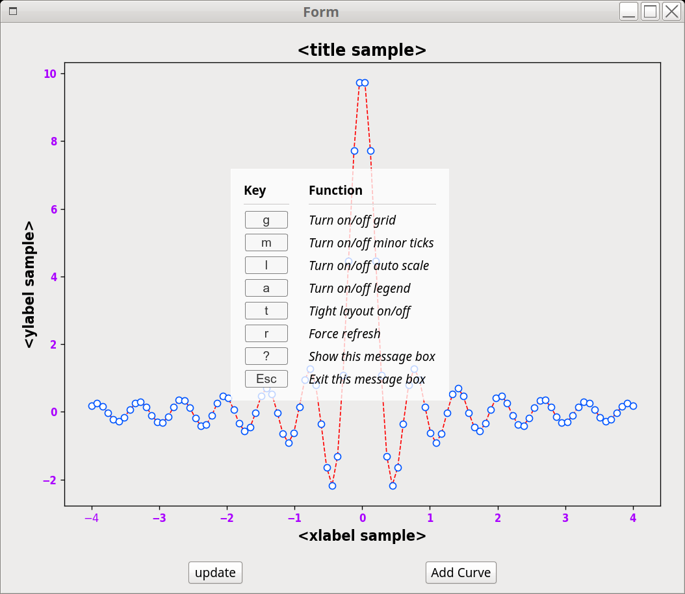

.. role:: raw-html(raw)
    :format: html

===================
Keyborard Shortcuts
===================

For :class:`~mpl4qt.widgets.MatplotlibCurveWidget`, the supported keyboard
shotcuts are:

+---------------------------+-------------------------+
| Prssed Key                |   Function              |
+===========================+=========================+
| :raw-html:`<kbd>a</kbd>`  | Turn on/off auto scale  |
+---------------------------+-------------------------+
| :raw-html:`<kbd>g</kbd>`  | Turn on/off grid        |
+---------------------------+-------------------------+
| :raw-html:`<kbd>l</kbd>`  | Turn on/off legend      |
+---------------------------+-------------------------+
| :raw-html:`<kbd>m</kbd>`  | Turn on/off minor ticks |
+---------------------------+-------------------------+
| :raw-html:`<kbd>r</kbd>`  | Force refresh           |
+---------------------------+-------------------------+
| :raw-html:`<kbd>s</kbd>`  | Change y-axis scale     |
+---------------------------+-------------------------+
| :raw-html:`<kbd>t</kbd>`  | Tight layout on/off     |
+---------------------------+-------------------------+
| :raw-html:`<kbd>?</kbd>`  | Show this message box   |
+---------------------------+-------------------------+
| :raw-html:`<kbd>Esc</kbd>`| Exit this message box   |
+---------------------------+-------------------------+

When running applications based on ``mpl4qt``, press the above keys will
instantly apply actions on the figure, press :raw-html:`<kbd>?</kbd>` will
pop up a dialog listing the short help message, just as the following
image shows:

