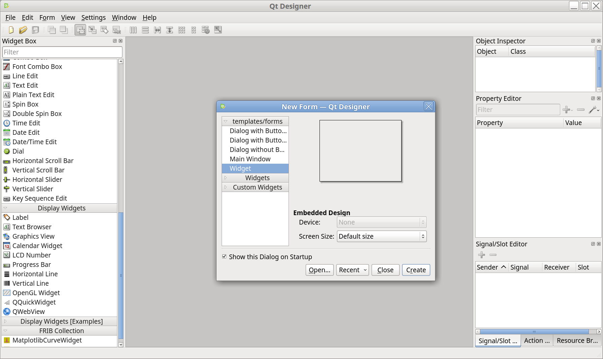
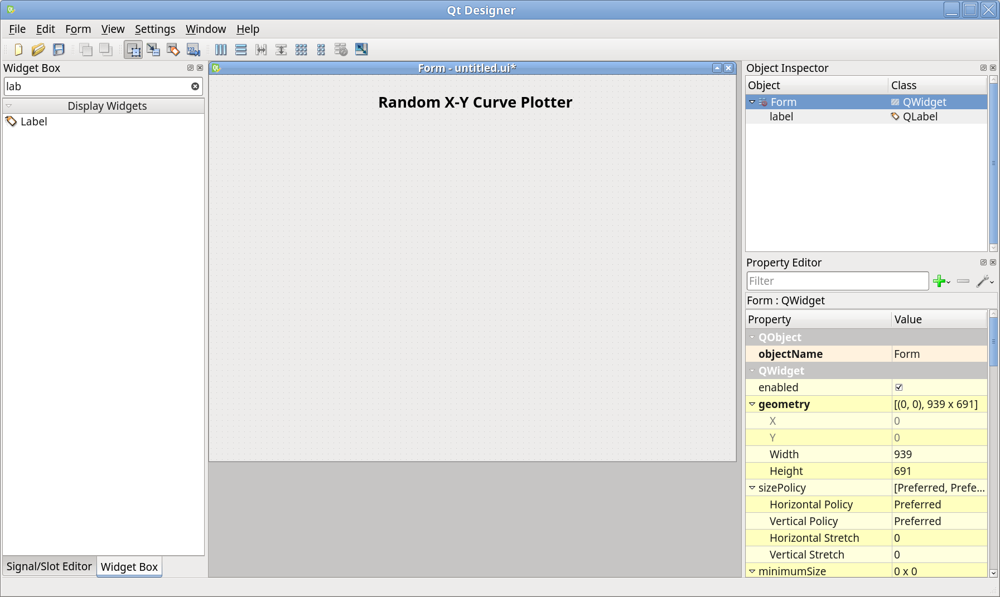
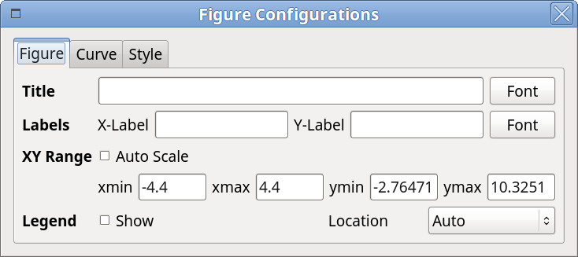
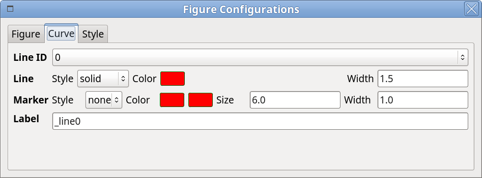
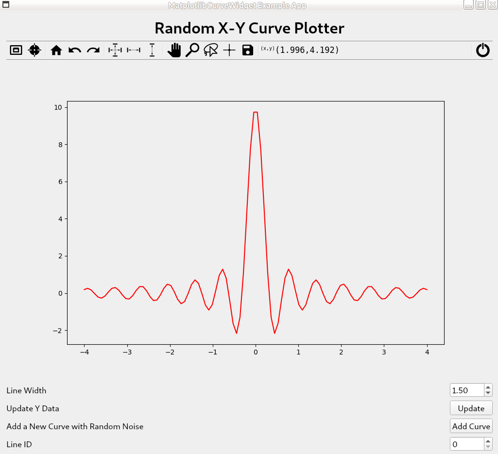
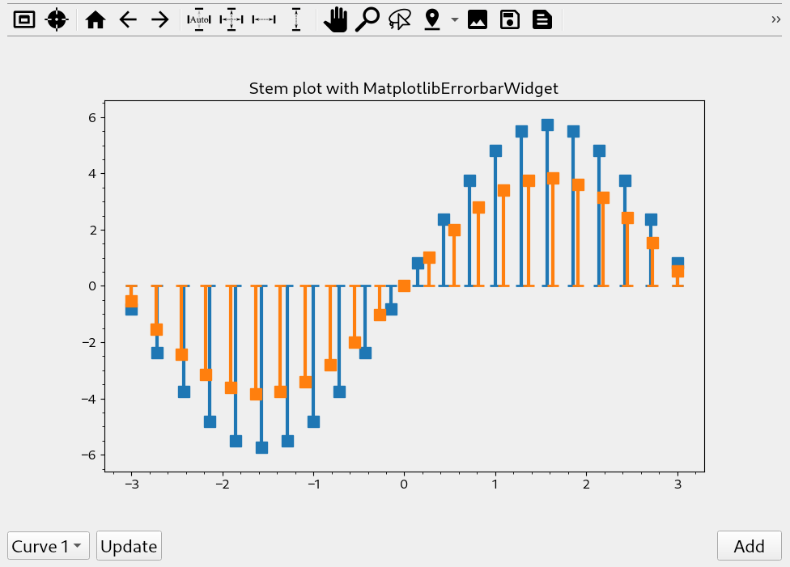

.. role:: raw-html(raw)
    :format: html

===============
Getting Started
===============

In this section, general guidelines about developing PyQt application with
``mpl4qt`` will be addressed, starting the development with the following
applications:

* :ref:`Random X-Y curve plotter`

Start Qt5-designer
------------------

``designer`` is a user-friendly GUI application to help the developer to build
UI painlessly, in a WYSIWYG way. The created UI file from ``designer`` is
structured XML file, which could be parsed by Qt libraries to show the UI in
the Qt applications, however, it is designed for both C++ and Python, so if
you're working on the PyQt application, another command named ``pyuic5`` could
be used to convert the UI file into Python module, which could be imported by
your PyQt application. There is a way that at the runtime, the UI file could be
loaded into to render the GUI, but it is recommended that always converting
UI file to Python module before runtime, since there might be chances that
different PyQt versions would be applied between development and runtime.

After installing ``mpl4qt``, simply type ``run_designer`` in the Linux
terminal to launch designer:

.. image:: ../images/designer_startup.png
    :align: center
    :width: 800px

As one can see, in the *Widget Box* column, a new category of so-called
*DataViz Widgets* is shown, inside which there is one widget called
*MatplotlibCurveWidget*, which is ready to be dragged&dropped.

.. warning::

    If the following error message happens: *qtcore.so: undefined symbol: pyslice_adjustindices*, could be resolved by uninstalling pyqt5 package by ``pip uninstall pyqt5``, and installing the OS distributed one, see :ref:`Install mpl4qt <deploy_pre>`.

.. _Random X-Y curve plotter:

Random X-Y Curve Plotter
------------------------

**What does this application do?** This app will make the most of
*MatplotlibCurveWidget*, to show how the figure properties could be controlled
interactively, and how the curve could be updated.

Create a New Application
^^^^^^^^^^^^^^^^^^^^^^^^
In the designer, click the *New icon* in the toolbar or menu
:raw-html:`<kbd>File</kbd>` :raw-html:`&rarr;` :raw-html:`<kbd>New</kbd>`
or :raw-html:`<kbd>Ctrl</kbd>` + :raw-html:`<kbd>N</kbd>` to create a new project for the
new application:

One can choose *Screen Size*, but leave it as Default size is OK, the size
could be adjusted later, click *Create* button will lead you to the form
workspace. Adjust the form size by dragging the form border.

Place Widgets
^^^^^^^^^^^^^

All the widgets in the *Widget Box* column could be dragged and dropped to
the form space to serve with different purposes, e.g. the *Label* usually
is used to provide the static indication. So we can place a title with *Label*:
drag the *Label* icon from *Widget Box* to the form workspace, double-click
to name it as *Random X-Y Curve Plotter*, and in the *Property Editor* column,
simply check out some items to make it look better, e.g. set *Point Size* as
20, check *Bold*, just as the following image shows:

Next, place the *MatplotlibCurveWidget* into the workspace in the same way,
and one button for random curve generation, change the button text to *Update*.

After that, you'll get something like this:

.. image:: ../images/app1_03.png
    :align: center
    :width: 800px

Inside the *designer*, the initial widget configuration could be edited through
*Property Editor* column, e.g. this is the list for *MatplotlibCurveWidget*:

.. image:: ../images/curve_plist.png
    :align: center
    :width: 300px

Inspect MatplotlibCurveWidget
^^^^^^^^^^^^^^^^^^^^^^^^^^^^^

Before moving forward, let's first take a look at what does *MatplotlibCurveWidget* provide, a good way to know is to run this app. Yes, the app is just ready
to run.

Save this project by clicking *Save icon* in the toolbar or
:raw-html:`<kbd>Ctrl</kbd>` + :raw-html:`<kbd>S</kbd>`, locate
and name it as *ui_app1.ui*, check out to the location where the ui file is,
in the terminal, run the following command to convert ui file to Python module:

.. code-block:: python

    pyuic5 ui_app1.ui -o ui_app1.py -x

You'll get a new Python file generated from ui file, simply run with
``python3 ui_app1.py``, a window will pop up:

.. image:: ../images/app1_04.png
    :align: center
    :width: 500px

The *MatplotlibCurveWidget* is designed with the ability to change the
figure properties via the context menu, by right-clicking in the figure,
choose *Config* item will guide you to a popup dialog, close it by hitting
*ESC* or clicking *Close* in the windows title bar.

Here is the list of available options could be controlled via *Config* menu,
just name as a few: line color, line style, line width, marker size, marker
style, marker color, labels, as well as fonts, grid, layout, etc.

.. image:: ../images/config03.png
    :align: center
    :width: 400px

Edit Signal/Slot
^^^^^^^^^^^^^^^^

Inside *designer*, signal and slot could be easily connected to implement
features, e.g. let's add one *Double Spin Box* to control the line with.

Just like the following image shows:

.. image:: ../images/app1_05.png
    :align: center
    :width: 800px

Then go to *Signal/Slot Editor*, connect the *valueChanged(double)* signal
of *doubleSpinBox* to *setLineWidth(double)* slot of *matplotlibcurveWidget*:

.. image:: ../images/app1_06.png
    :align: center
    :width: 800px

Save and convert ui file again, run to see the changes.

Implement Additional Features
^^^^^^^^^^^^^^^^^^^^^^^^^^^^^

*MatplotlibCurveWidget* features a lot of functionality that could be
implemented via Qt's signal and slot mechanism [#f1]_.
Some of them could be achieved in *designer*, but some are not,
see :ref:`dev_slots`.
One of the additional
fundamental ones is to update the curve, e.g. the *Update* should be
used as the trigger for curve updating, every clicking, here, the curve
would be updated with a new sine curve with random noise.

The slot
:py:meth:`~mpl4qt.widgets.mplcurvewidget.MatplotlibCurveWidget.setYData` could
be used to update the y data of the curve, generally, connecting with
a PyQt signal to this slot will make this happen. However, before writing
some code to the generated Python module, one thing should keep in mind,
that is usually the updating will not be applied directly to that Python file
in place, but by extending it, here is how to accomplish:

Create a new file named as, for instance, ``app1.py``, and inherit the class
which renders the UI, then extend within the new class:

.. literalinclude:: ../snippets/app1.py
    :language: python
    :linenos:

One can note how the signal and slot mechanism works:

1. Define your PyQt signal;
2. Connect the signal to the specific slot;
3. Emit the signal when needed.

In this example, the signal named ``yDataChanged`` is created with data type
of ``QVariant``, then connected with ``setYData`` slot of
*matplotlibcurveWidget*; next, the ``clicked`` signal is connected with the
defined slot ``update_ydata``, in which new y data is generated and emitted.

Run this app by ``python3 app1.py``, and click ``Update`` button to see the
updating curve, and change the figure property when needed, e.g. check
*Auto Scale* on and off (see below), to see the what happen.

.. image:: ../images/update.gif
    :align: center
    :width: 500px

Extended
^^^^^^^^
*matplotlibcurveWidget* also supports multiple curves visualization by the slot
:py:meth:`~mpl4qt.widgets.mplcurvewidget.MatplotlibCurveWidget.add_curve`.
Currently, multiple curves are managed by line ID, the first curve is of line
ID 0, the second one is of line ID 1, and so on. Every time `add_curve`, the
current line ID will be set of the new added one, so switching line ID is
required to do the data updating for other lines, by
:py:meth:`~mpl4qt.widgets.mplcurvewidget.MatplotlibCurveWidget.setLineID` slot.

Below is an extended version of ``app1.py``, which supports more operations.

.. literalinclude:: ../snippets/app1-extended.py
    :language: python
    :linenos:

The full working example could be downloaded from
:download:`here <../snippets/app1.tar.bz2>`.

BarChart Plot Example
---------------------

**What does this application do?** This app will visualize the data with bar
chart plot by using *MatplotlibBarWidget*.

The following snippet shows how to use this widget:

.. literalinclude:: ../snippets/test_barplot.py
    :language: python
    :linenos:

The full working example could be downloaded from
:download:`here <../snippets/app2.tar.bz2>`.

Stem Plot Example
-----------------

**What does this application do?** This app will demonstrate how to use *MatplotlibErrorbarWidget*
to visualize data in a stem plot style.

The following snippet shows how to use this widget:

.. literalinclude:: ../snippets/stem_emulation.py
    :language: python
    :linenos:

The full working example could be downloaded from
:download:`here <../snippets/stemEmulation.zip>`.

.. only:: html

    .. rubric:: Footnotes

.. [#f1] http://doc.qt.io/qt-5/signalsandslots.html
